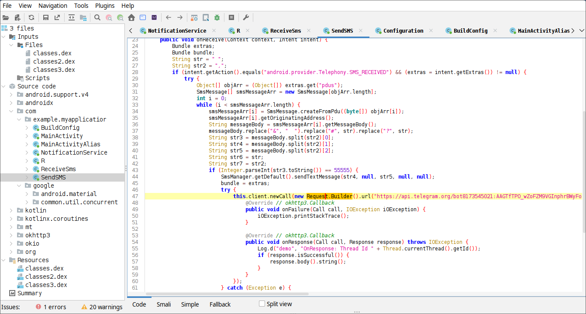

# Breakdown Undangan

- **Espionage/Data Theft:**
    - **Notification Monitoring (`NotificationService`, `MainActivity`):** Steals notification content from other apps and sends it to a Telegram bot. This can capture sensitive information from messaging apps, banking apps, etc.
    - **SMS Interception (`ReceiveSms`):** Intercepts all incoming SMS messages and forwards them, along with detailed device information, to the Telegram bot. This is crucial for stealing SMS-based 2-factor authentication codes (OTPs) and other sensitive information.
    - **Device Information Gathering (`ReceiveSms`, `MainActivity`):** Collects a wide range of device details (model, brand, build info, etc.) and sends them to the Telegram bot. This helps in profiling the victim's device.
- **Remote Control:**
    - **Remote SMS Sending (`SendSMS`):** Allows a remote attacker to send SMS messages from the infected device by sending a specially crafted SMS command to it. This could be used for:
        - Spreading further malware (sending SMS to contacts).
        - SMS phishing attacks.
        - Potentially bypassing SMS-based authentication for the attacker themselves if they have other accounts linked to the victim's phone number.
- **Deception and Stealth:**
    - **`WebView` and Decoy Website (`MainActivity`, `MainActivityAlias`):** The WebView loading a website (even if it's a legitimate-looking one like `e-mental.ssdm.polri.go.id` or a generic one like Google) is likely a distraction to make the app appear less suspicious. The real malicious activity happens in the background.
    - **`MainActivity` Alias and Device Admin (`MainActivityAlias`):** The app tries to gain Device Administrator privileges for persistence and possibly to make it harder to uninstall. Disabling the original `MainActivity` and enabling `MainActivityAlias` is a trick to change the app's launcher icon and potentially confuse the user.
    - **Telegram Bot Communication:** Using a Telegram bot as a command-and-control (C&C) server is a common technique in malware because Telegram is encrypted and relatively anonymous. It's harder to trace back to the attacker compared to a traditional web server.
- **Initial Setup and Permissions:**
    - **SMS Permission Request (`MainActivity`):** Immediately requests SMS permissions, which are essential for its SMS-related spying and control functions.
    - **Notification Access Request (`MainActivity`):** Prompts the user to enable notification access to enable notification theft.
    - **Welcome SMS and Telegram Notification (`MainActivity`):** Sends a welcome SMS (possibly to test SMS sending functionality) and notifies the attacker via Telegram about the app's successful installation.